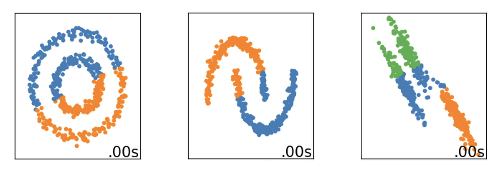
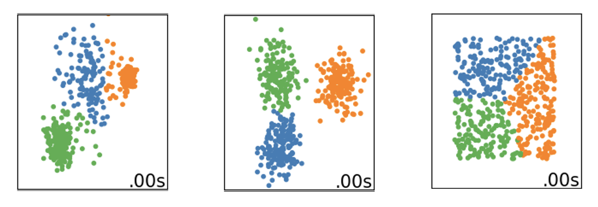

# K-means Clustering

## Introduction

Clustering is an unsupervised machine learning technique that learns patterns from the features of a dataset without using labels. *K-means* is a simple algorithm that attempts to partition samples into $K$ groups with roughly equal variance, although the latter is not guaranteed.

## Overview

* Unsupervised machine learning technique
* "K-means" = "K averages" / "K central tendencies" / "K centroids"
* Can be looked at as a prototyping tool that discretizes the data into $K$ prototypes

## Algorithm

According to the *Scikit Learn Documentation*, the K-means algorithm "divides a set of $N$ samples $X$ into $K$ disjoint clusters $C$, each described by the mean $\mu_j$ of the samples in the cluster". These means are referred to as *centroids*, and despite living in the same space, they are usually not part of the dataset. The number $K$ is required to be initialized, along with the starting positions of the centroids. The algorithm has an objective function that minimizes the criterion of *within-cluster sum-of-squares*, the so-called *inertia*.

$$
\sum^n_{i=0} \min_{\mu_j \in C} (|| x_i - \mu_j ||^2)
$$

Inertia is "a measure of how internally coherent clusters are". It assumes that clusters are convex and isotropic. As the documentation highlights it, it suffers from drawbacks:

- performs poorly on elongated clusters or manifolds with irregular shapes
- not normalized: lower values are better, zero is optimal, yet in higher-dimensions distances get inflated

The algorithm follows an iterative process that consists of three main steps.

- initialize centroid positions
- assign each sample to its nearest centroid
- create new centroids by taking the mean value of the samples assigned to each previous centroid,

then the difference between old and new centroids are calculated and the algorithm loops between steps 2) and 3) until this difference becomes small considering a threshold.

The documentation highlights yet another weakness of the algorithm at the stage of centroid initialization, as written, "K-means will always converge, however this may be to a local minimum". This outcome depends on the initial positions of the centroids, which if assigned randomly, may not find every cluster in the dataset. To address this, the algorithm in the *sklearn* library can be instructed to use a more intelligent initialization technique that places centroids distant from each other and can be used via the $init="\text{k-means++}"$ argument value. Besides the $n\_init$ parameter can be used to enhance this process, which is the "number of times the k-means algorithm is run with different centroid seeds" where the candidate with the best inertia is kept.
